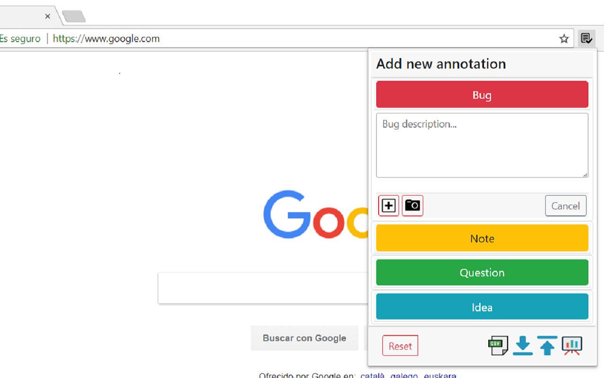

# A Chrome Extension for Exploratory Testing

A Chrome extension designed for making web exploratory testing easier

**Features**

 - Report bugs and actions easily
 - Take screenshots during the session. Keep focused 
 - URL will be tracked automatically
 - See session results in a report
 - Export session to CSV or HTML

**Annotate any thought while you test easily and take screenshots without changing context**

**View session results in a report**

